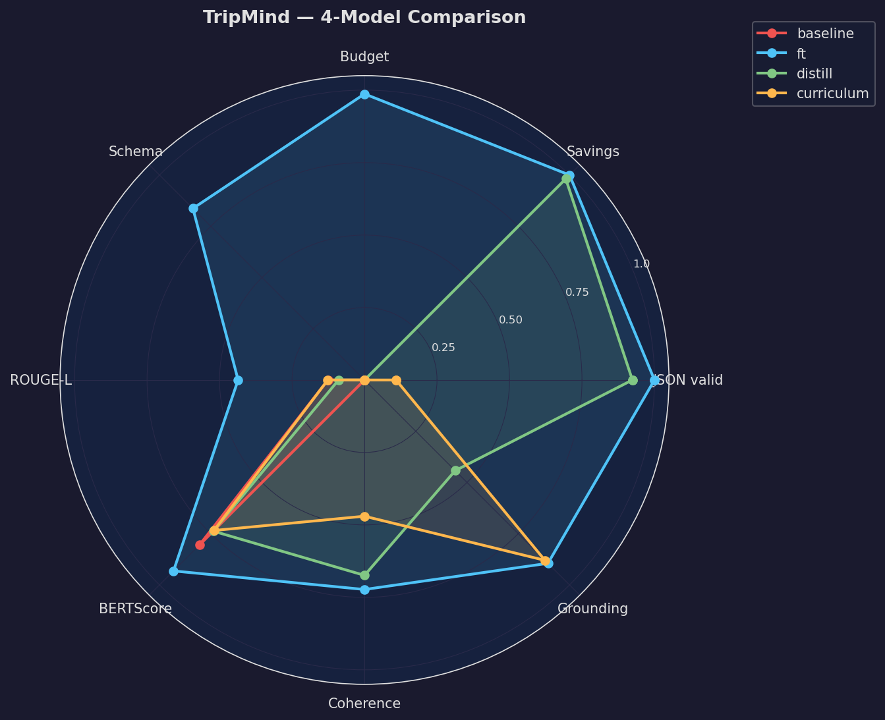
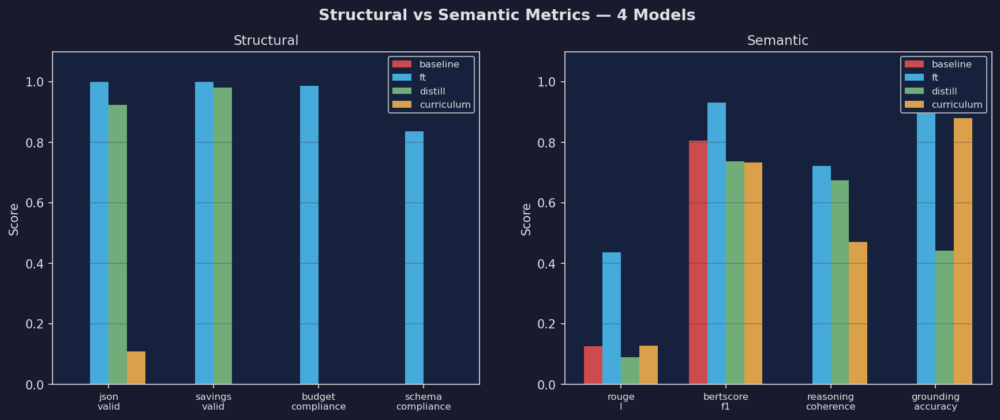
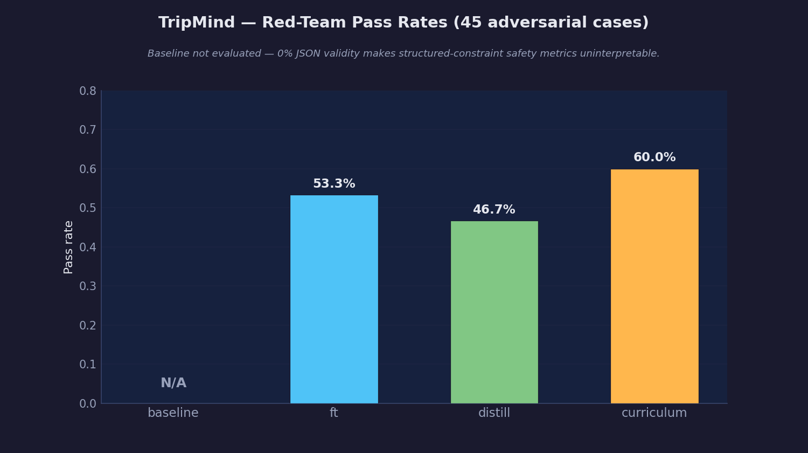

# TripMind

Autonomous multi-agent AI travel optimizer that finds **Price-Pivot Points** — transit, accommodation, and activity substitutions that save ≥5% without degrading trip quality. Built for Indian domestic travel across 20 cities and 5 budget tiers.

The project trains three Llama 3.1 8B LLMs via different supervision signals (SFT, distillation, curriculum learning), then benchmarks all three against an untuned baseline to answer a concrete research question: **does richer teacher signal from multi-agent reasoning traces produce a better travel optimizer than plain SFT on synthetic pairs?**

**Total data cost: $8.** GPT-4o-mini produced 5,000 synthetic training pairs for $4. DeepSeek V4 Flash produced 500 multi-agent reasoning traces for $4. Equal spend, different data strategies — this makes the fine-tune vs. distill comparison methodologically sound. Training compute (Colab T4, Lightning.ai A100), inference (Ollama), and all external APIs were free.

---

## How It Works

```
50k seed personas
        │  GPT-4o-mini ($4)
        ▼
5,000 validated (baseline, optimized) itinerary pairs
        │  DeepSeek V4 Flash multi-agent pipeline ($4)
        ▼
500 grounded agent reasoning traces
        │  QLoRA fine-tuning (Unsloth, Llama 3.1 8B)
        ▼
tripmind-ft           ← SFT on synthetic pairs
tripmind-distill      ← distilled from agent traces
tripmind-curriculum   ← Phase 1 → Phase 2 sequential
        │  92-case evaluation + 45 red-team prompts
        ▼
Benchmark results across 10 metrics
        │  FastAPI + Ollama
        ▼
REST inference API (POST /optimize, GET /results/summary)
```

---

## Evaluation Results

92 test cases across all four models. Full analysis: [`RESULTS.md`](RESULTS.md).

| Metric | baseline | tripmind-ft | tripmind-distill | tripmind-curriculum |
|--------|:--------:|:-----------:|:----------------:|:-------------------:|
| JSON valid | 0.0% | **100%** | 92.4% | 10.9% |
| Savings found | — | **100%** | 98.1% | — |
| Budget compliance | — | **98.7%** | — | — |
| Schema compliance | 0.0% | **83.7%** | 0.0% | 0.0% |
| ROUGE-L | 12.6% | **43.6%** | 8.9% | 12.7% |
| BERTScore F1 | 80.5%† | **93.2%** | 73.8% | 73.4% |
| Intent alignment | — | 32.2% | — | 41.8% |
| Reasoning coherence | — | **72.3%** | 67.4% | 47.0% |
| Grounding accuracy | —‡ | **89.5%** | 44.2% | **88.0%** |
| Red-team pass | —§ | 53.3% | 46.7% | **60.0%** |

† Baseline BERTScore is misleadingly high despite 0% JSON validity — semantic embedding similarity rewards natural language that mentions the same cities and concepts even without structure. ROUGE-L (12.6%) correctly captures the format gap.  
‡ Grounding accuracy uses an LLM judge on parsed JSON output — not applicable when JSON validity is 0%.  
§ Red-team adversarial evaluation requires structured output to assess constraint compliance — not applicable at 0% JSON validity.

**Pairwise comparison (LLM judge, 92 cases):** tripmind-ft produced the better itinerary in 72 of 92 cases versus tripmind-distill (78% win rate), and in 52 of 92 cases versus tripmind-curriculum (57%). The distill vs. curriculum matchup was essentially a coin flip at 52%.






---

## Tech Stack

| Component | Technology | Cost |
|-----------|-----------|------|
| Synthetic data | OpenAI gpt-4o-mini | **$4.00** — 5,000 training pairs |
| Agent reasoning traces | DeepSeek V4 Flash (`deepseek-chat`) | **$4.00** — 500 traces (budget-matched to Phase 1) |
| Eval judge | DeepSeek V4 Flash (`deepseek-chat`) | Included in Phase 2 key |
| LLM base model | Llama 3.1 8B (Unsloth + QLoRA r=8) | Free |
| LLM training (ft) | Colab T4, fp16, seq_len=512 | Free |
| LLM training (distill, curriculum) | Lightning.ai A100, bf16, seq_len=16384 | Free (3h credit) |
| LLM inference | Ollama (local, GGUF Q4_K_M, 4.6 GB each) | Free |
| Routing | OpenRouteService + Nominatim | Free |
| Hotels / POIs | Overpass API (OpenStreetMap) + haversine | Free |
| Web search | duckduckgo-search (no API key) | Free |
| Intent alignment | sentence-transformers `all-MiniLM-L6-v2` (local) | Free |
| Inference API | FastAPI + Uvicorn | Free |

---

## Project Structure

```
travel_project/
├── config.py                        # all shared constants (budget tiers, cities, model names)
├── requirements.txt
├── utils/
│   ├── logger.py                    # structured JSON logger
│   ├── cache.py                     # disk-based API response cache
│   └── geo.py                       # haversine distance (shared by MCP servers)
├── phase1_data_engine/
│   ├── generate.py                  # async gpt-4o-mini pipeline, checkpoint-safe
│   ├── validate.py                  # 3-gate validator (hostel, savings, budget bounds)
│   └── schemas.py
├── phase2_agents/
│   ├── mcp_servers/
│   │   ├── routing_server.py        # port 8001 — OpenRouteService + Nominatim
│   │   ├── hotels_server.py         # port 8002 — Overpass hotels + haversine
│   │   ├── overpass_server.py       # port 8003 — OSM POIs + restaurants
│   │   └── search_server.py         # port 8004 — DuckDuckGo
│   ├── agents/
│   │   ├── analyst.py               # transit + hotel cost analysis
│   │   ├── concierge.py             # POI + dining substitutions
│   │   └── optimizer.py             # final itinerary synthesis
│   ├── supervisor.py                # orchestrates the 3-agent chain
│   ├── mcp_adapter.py               # MCP → OpenAI-compatible tool bridge
│   └── run.py                       # CLI entrypoint
├── phase3_training/
│   ├── prepare_ft.py / prepare_distill.py / prepare_curriculum.py
│   ├── verify_datasets.py
│   └── notebooks/
│       ├── 01_train_ft.ipynb        # Colab T4: tripmind-ft (3 epochs)
│       ├── 02_train_distill.ipynb   # Lightning.ai A100: tripmind-distill (5 epochs)
│       ├── 03_train_curriculum.ipynb# Lightning.ai A100: tripmind-curriculum (2-stage)
│       └── modelfiles/              # Ollama Modelfile for each model
├── phase4_evals/
│   ├── build_golden_set.py / generate_responses.py / score_responses.py
│   ├── metrics.py / judge_prompts.py / compare.py / red_team.py
│   └── notebooks/
│       ├── 04_generate_responses.ipynb
│       ├── 05_baseline_comparison.ipynb
│       └── results_analysis.ipynb
├── phase5_serving/
│   └── api/
│       ├── main.py                  # FastAPI app (5 endpoints)
│       ├── schemas.py               # Pydantic validation + model registry
│       └── ollama_client.py         # async Ollama wrapper
├── data/
│   ├── evals/                       # golden set, eval results, charts (committed)
│   ├── synthetic/                   # 5,000 training pairs (gitignored, reproducible)
│   ├── traces/                      # 500 agent traces (gitignored, reproducible)
│   └── training/                    # 6 Alpaca JSONL files (gitignored, reproducible)
└── models/                          # 3× 4.6 GB GGUFs (gitignored, on HuggingFace)
```

---

## Setup

```bash
pip install -r requirements.txt
cp .env.example .env
# Fill in: OPENAI_API_KEY, DEEPSEEK_API_KEY, ORS_API_KEY
```

---

## Running the Agent Pipeline

```bash
# Terminal 1–4: start MCP servers
python phase2_agents/mcp_servers/routing_server.py   # port 8001
python phase2_agents/mcp_servers/hotels_server.py    # port 8002
python phase2_agents/mcp_servers/overpass_server.py  # port 8003
python phase2_agents/mcp_servers/search_server.py    # port 8004

# Terminal 5: run agents
python phase2_agents/run.py --limit 25 --concurrency 3 --verbose
```

---

## Running Inference

Register GGUFs with Ollama (run once from project root):

```bash
ollama create tripmind-ft         -f phase3_training/notebooks/modelfiles/Modelfile.ft
ollama create tripmind-distill    -f phase3_training/notebooks/modelfiles/Modelfile.distill
ollama create tripmind-curriculum -f phase3_training/notebooks/modelfiles/Modelfile.curriculum
ollama pull llama3.1:8b

ollama run tripmind-ft "Persona: Solo, Delhi to Goa, Budget+, 5 days. Optimize."
```

HuggingFace model repos (LoRA + GGUF): `agurusantosh/tripmind-{ft,distill,curriculum}-{lora,gguf}`

---

## REST API

```bash
uvicorn phase5_serving.api.main:app --reload --port 8000
open http://localhost:8000/docs    # Swagger UI
```

```bash
curl -X POST http://localhost:8000/optimize \
  -H "Content-Type: application/json" \
  -d '{"model": "tripmind-ft", "persona": {
        "starting_city": "Mumbai", "destination_city": "Delhi",
        "type": "Solo", "size": {"adults": 1, "children": 0},
        "intents": ["Adventure"], "budget": "Shoestring",
        "duration_days": 5, "duration_nights": 4}}'
```

Endpoints: `GET /health`, `GET /models`, `POST /optimize`, `GET /results/summary`, `GET /results/compare`

---

## Key Design Decisions

**Why 5,000 synthetic pairs and 500 agent traces?** Budget parity. GPT-4o-mini produced 5,000 validated pairs for exactly $4. DeepSeek V4 Flash multi-agent traces (each involving 4 agents and 3–5 real API tool calls) produced 500 traces for exactly $4. Same spend, different data strategy — the comparison measures signal quality, not scale.

**Why three training approaches?** Testing a research question: does distilling multi-agent reasoning chains produce a better travel optimizer than plain SFT on synthetic pairs? Curriculum training tests whether sequential domain-then-reasoning training beats both single-dataset approaches.

**Why DeepSeek V4 Flash for both agents and eval judge?** OpenAI-compatible API, strong function-calling, and cost-effective for both Phase 2 trace generation and Phase 4 LLM judging. Using the same model for both keeps the eval pipeline self-consistent.

**Why MCP servers?** Standard protocol via the official `mcp` Python library (SSE transport). The same 4 servers plug directly into Claude Desktop or Claude Code without modification.

**Why cache all API responses?** The 20-city network has ~380 unique city pairs. Caching collapses 500 agent runs to ~40 real Overpass/ORS calls — well within free-tier rate limits.

**Why Ollama + GGUF for inference?** The trained models are 8B parameter LLMs quantized to Q4_K_M (4.6 GB each). Ollama runs them on consumer hardware (MacBook Air 8 GB) with no GPU required, making the full pipeline reproducible without cloud infrastructure.
